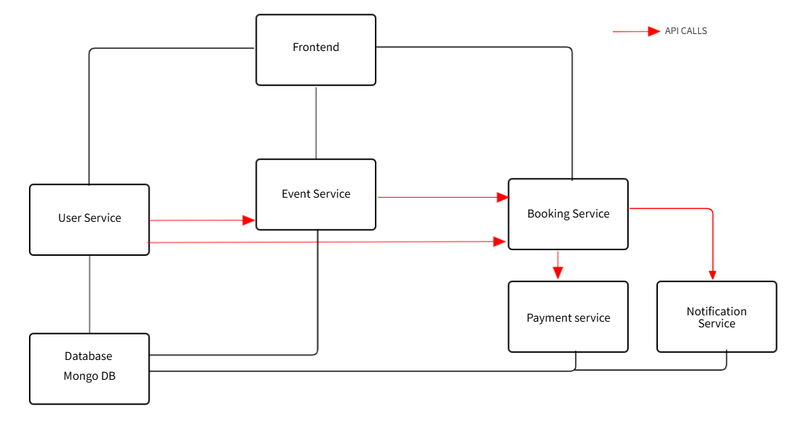

# Event Booking Microservices Application

This is a **simple microservices-based event booking application**, designed to demonstrate how **multiple independent services** can work together to handle user registration, event management, bookings, payments, and notifications.

---

## 📖 Overview

The system is split into the following **microservices**, each having a different responsibility:

- **User Service**: Manages user registration, login, and profiles.
- **Event Service**: Handles event creation, listing, and ticket availability.
- **Booking Service**: Manages user bookings, links them with events, and triggers payment and notifications.
- **Payment Service**: Processes payments for bookings.
- **Notification Service**: Sends notifications to users after successful bookings and payments.

---

## 🏛️ Architectural Diagram



---

## 🔗 Services Overview

### 1️⃣ User Service

Handles all **user-related operations**.

- **Technology:** Node.js (Express) + MongoDB
- **Core Endpoints:**
  - `POST /users/register` - Register new users
  - `POST /users/login` - Login user
  - `GET /users/:id` - Get user profile

---

### 2️⃣ Event Service

Manages the **events** and their **availability**.

- **Technology:** Node.js (Express) + MongoDB
- **Core Endpoints:**
  - `GET /events` - List all events
  - `GET /events/:id/availability` - Check ticket availability for a specific event

---

### 3️⃣ Booking Service

Handles the **booking process**, communicating with **Payment** and **Notification Services**.

- **Technology:** Node.js (Express) + MongoDB
- **Core Endpoints:**
  - `POST /bookings` - Create a booking
  - `GET /bookings/:id` - Get booking details

---

### 4️⃣ Payment Service

Processes **payments** for bookings.

- **Technology:** Node.js (Express)
- **Core Endpoints:**
  - `POST /payments` - Process payment for a booking

---

### 5️⃣ Notification Service

Sends **notifications** to users upon successful booking and payment.

- **Technology:** Node.js (Express)
- **Core Endpoints:**
  - `POST /notifications` - Send notification

---

## ⚙️ Technologies Used

| Service              | Tech Stack                  |
| -------------------- | --------------------------- |
| User Service         | Node.js (Express) + MongoDB |
| Event Service        | Node.js (Express) + MongoDB |
| Booking Service      | Node.js (Express) + MongoDB |
| Payment Service      | Node.js (Express) + MongoDB |
| Notification Service | Node.js (Express) + MongoDB |

---

## 🚀 Running the Application

### 1. Clone the Repository

```bash
git clone <repository-url>
cd event-booking-microservices
```
